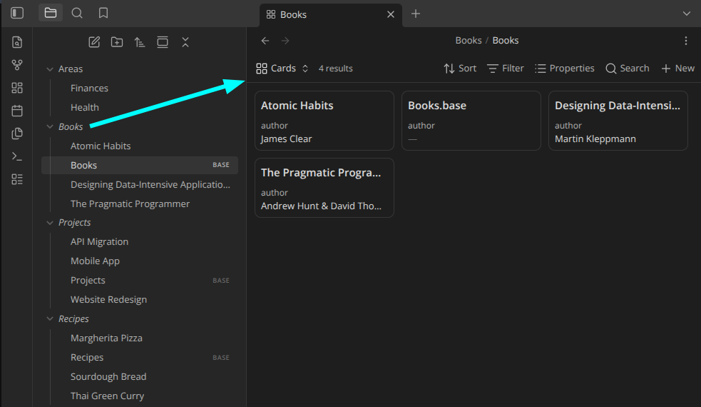

# Folder Bases



Open a folder's associated [Base](https://help.obsidian.md/bases) by clicking it
in the file explorer — like the *Folder Notes* community plugin, but for `.base`
files instead of notes.

## Features

- Click a folder to open its base (plain click or modifier + click — configurable).
- Configurable base filename, with `{{folder_name}}` / `{{folder_path}}` tokens
  (default: a same-named `.base` inside the folder).
- Optionally create a base from a template on modifier + click when none exists.
- Scope which folders respond with an exclude/include filter (glob patterns,
  optional subfolder matching).
- The collapse chevron always expands/collapses, so normal folder navigation is
  never lost.
- Right-click a folder for **Open folder base** / **Create folder base**.

## Install (from source)

```bash
devbox run build      # type-check + bundle to main.js
# or: devbox run dev  # watch mode
devbox run test       # run the unit tests
```

Then enable **Folder Bases** in Settings → Community plugins. To use in another
vault, copy `manifest.json`, `main.js`, and `styles.css` into
`<vault>/.obsidian/plugins/folder-bases/`.

## Releasing

`devbox run release <version>` bumps the version in `manifest.json`,
`package.json`, and `versions.json`, builds, commits, pushes, and creates a
GitHub release with `main.js`, `manifest.json`, and `styles.css` attached:

```bash
devbox run release 1.0.1   # or: just release 1.0.1
```

Requires a clean working tree and `gh` authenticated to the repo. Use a plain
semver version with no leading `v` (Obsidian tags omit it).

## Documentation

- [Usage & settings](docs/usage.md)
- [The `.base` file format](docs/bases-format.md)
- [Architecture](ARCHITECTURE.md)
- [Roadmap](ROADMAP.md)

## Known limitations

- The click listener is attached to the main window's document. If you move the
  file explorer into a popout window, clicks there are not yet intercepted.

## License

[MIT](LICENSE)
